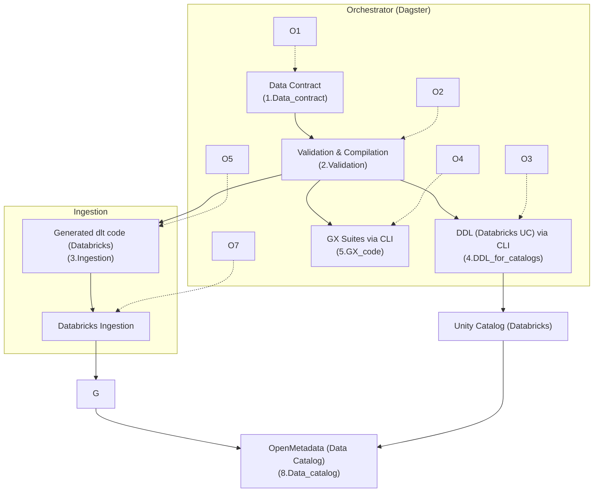

# a## Description

## Project structure

1. Data contract (`1.Data_contract/`)
2. Validation & artifacts (`2.Validation/`)
3. DLTHub Ingestion (`3.Ingestion/`)
4. DDL for catalogs (`4.DDL_for_catalogs/`)
5. Great Expectations (`5.GX_code/`)
6. Data processing (`6.Data_processing/`)
7. Dagster Orchestrator (`7.Orchestrator/`)
8. Data Catalog (OpenMetadata) (`8.Data_catalog/`)

## Typical workflow
1) Generate a small synthetic dataset (Olist mini) and validate the contract
2) Generate DDL, GX suites and dlt pipeline from the contract
3) Load data into Databricks (SQL Warehouse) with dlt
4) Orchestrate the step sequence with Dagster
5) Launch OpenMetadata Data Catalog locally and configure ingestionsnstrates a complete "Data Trust by Design" value chain, from data contract definition to orchestration and catalog publication:
- Define producer contracts (schema, quality, SLA, security)
- Validate and compile these contracts to generate artifacts (JSON schemas, DDL, test suites)
- Generate ingestion code (dlt) with expectations (not_null, unique, min/enum/regex)
- Execute quality checks (Great Expectations) and cross-cutting checks
- Publish schemas to warehouse/catalog
- Orchestrate everything (Dagster)peline
Automated Pipeline & Data Trust by Design

## Description

Ce projet démontre une chaîne de valeur “Data Trust by Design” complète, de la définition d’un contrat de données jusqu’à l’orchestration et la mise à disposition dans un catalogue:
- Définir des contrats producteurs (schéma, qualité, SLA, sécurité)
- Valider et compiler ces contrats pour générer des artefacts (schémas JSON, DDL, suites de tests)
- Générer le code d’ingestion (dlt) avec des attentes (not_null, unique, min/enum/regex)
- Exécuter des contrôles de qualité (Great Expectations) et des checks transverses
- Publier des schémas dans l’entrepôt/cataloque
- Orchestrer le tout (Dagster)

## Structure du projet

1. Data contract (`1.Data_contract/`)
2. Validation & artefacts (`2.Validation/`)
3. Ingestion DLTHub (`3.Ingestion/`)
4. DDL pour catalogues (`4.DDL_for_catalogs/`)
5. Great Expectations (`5.GX_code/`)
6. Data processing (`6.Data_processing/`)
7. Orchestrateur Dagster (`7.Orchestrator/`)
8. Data Catalog (OpenMetadata) (`8.Data_catalog/`)

## Parcours type
1) Générer un petit dataset synthétique (Olist mini) et valider le contrat
2) Générer DDL, suites GX et pipeline dlt depuis le contrat
3) Charger les données dans Databricks (SQL Warehouse) avec dlt
4) Orchestrer l’enchaînement des étapes avec Dagster
5) Lancer le Data Catalog OpenMetadata en local et configurer des ingestions

## Quick start (PowerShell)
- Install Python dependencies:
  
  ```powershell
  py -m pip install -r requirements.txt
  ```

- Generate data + validate contract:
  
  ```powershell
  py .\scripts\generate_olist_mini.py
  py .\2.Validation\contract_validator.py .\1.Data_contract\olist_mini\contract.yaml
  ```

- Generate DDL & GX suites via Data Contracts CLI + dlt pipeline:
  
  ```powershell
  # Install CLI (once) – see official project documentation
  # pipx install data-contract-cli
  data-contract-cli ddl --dialect databricks --contract .\1.Data_contract\olist_mini\contract.yaml --out .\4.DDL_for_catalogs\ddl_cli
  data-contract-cli gx --contract .\1.Data_contract\olist_mini\contract.yaml --out .\5.GX_code\suites_cli
  py .\3.Ingestion\generate_dlt_pipeline_databricks.py .\1.Data_contract\olist_mini\contract.yaml
  ```

- Execute ingestion (Databricks SQL Warehouse):
  
  ```powershell
  $env:OLIST_DATA_DIR = "data/olist_mini"
  $env:DLT_DATASET = "raw_olist"
  $env:DATABRICKS_SERVER_HOSTNAME = "<workspace-host>"
  $env:DATABRICKS_HTTP_PATH = "/sql/1.0/warehouses/<id>"
  $env:DATABRICKS_ACCESS_TOKEN = "<token>"
  py .\3.Ingestion\pipelines\contract_databricks_pipeline.py
  ```
- Dagster Orchestrator (UI):
  
  ```powershell
  dagster dev -m 7.Orchestrator.orchestrator
  ```

- OpenMetadata Data Catalog:
  
  ```powershell
  cd .\8.Data_catalog; cp .env.example .env; docker compose up -d; start http://localhost:8585
  ```

## Links
- Data Contracts: https://datacontract.com/
- DLTHub: https://dlthub.com/
- Great Expectations: https://greatexpectations.io/
- Dagster: https://dagster.io/
- OpenMetadata: https://open-metadata.org/

## Flow diagram (Mermaid)


